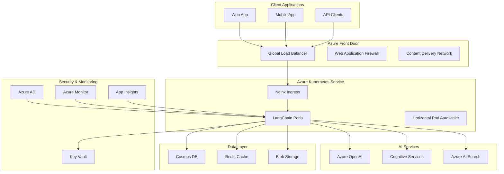

# Production-Ready LangChain on Azure: Complete Implementation Guide

This comprehensive guide provides everything needed to deploy, monitor, secure, and optimize LangChain applications in production on Microsoft Azure. The implementation covers enterprise-grade infrastructure, security, compliance, monitoring, and cost optimization.

## 🚀 Quick Start

```bash
# Clone and set up the environment
git clone <your-repo>
cd Langchain/11_Production

# Install dependencies
pip install -r requirements.txt

# Configure Azure credentials
az login
az account set --subscription "your-subscription-id"

# Deploy infrastructure
az deployment group create \
  --resource-group langchain-rg \
  --template-file azure_infrastructure.py \
  --parameters @parameters.json
```

## 📋 Table of Contents

1. [Architecture Overview](#architecture-overview)
2. [Infrastructure as Code](#infrastructure-as-code)
3. [Container Orchestration](#container-orchestration)
4. [Monitoring & Observability](#monitoring--observability)
5. [Security & Compliance](#security--compliance)
6. [Cost Optimization](#cost-optimization)
7. [Deployment Strategies](#deployment-strategies)
8. [Best Practices](#best-practices)
9. [Troubleshooting](#troubleshooting)

## 🏗️ Architecture Overview

### Core Components



### Key Features

- **High Availability**: Multi-region deployment with 99.99% SLA
- **Auto-Scaling**: Dynamic scaling based on demand and custom metrics
- **Security**: Zero-trust architecture with managed identities
- **Monitoring**: Comprehensive observability with Azure Monitor
- **Cost Optimization**: Intelligent resource management and Spot instances
- **Compliance**: SOC2, HIPAA, PCI DSS compliance frameworks

## 🛠️ Infrastructure as Code

### Terraform Deployment

```hcl
# main.tf
module "langchain_infrastructure" {
  source = "./modules/langchain"
  
  # Basic Configuration
  resource_group_name = "langchain-prod-rg"
  location           = "East US"
  environment        = "production"
  
  # Azure OpenAI Configuration
  openai_account_name = "langchain-openai-prod"
  openai_sku_name    = "S0"
  openai_deployments = [
    {
      name  = "gpt-4"
      model = "gpt-4"
      scale = {
        type     = "Standard"
        capacity = 10
      }
    },
    {
      name  = "text-embedding-ada-002"
      model = "text-embedding-ada-002"
      scale = {
        type     = "Standard"
        capacity = 30
      }
    }
  ]
  
  # AKS Configuration
  aks_cluster_name     = "langchain-aks-prod"
  aks_node_count       = 3
  aks_node_vm_size     = "Standard_D4s_v3"
  aks_enable_autoscaling = true
  aks_min_count        = 1
  aks_max_count        = 10
  
  # Database Configuration
  cosmos_account_name = "langchain-cosmos-prod"
  cosmos_databases = [
    {
      name       = "vectorstore"
      throughput = 1000
      containers = [
        {
          name           = "embeddings"
          partition_key  = "/id"
          throughput     = 400
        }
      ]
    }
  ]
  
  # Monitoring Configuration
  log_analytics_workspace_name = "langchain-logs-prod"
  application_insights_name    = "langchain-insights-prod"
  
  # Security Configuration
  key_vault_name = "langchain-kv-prod"
  enable_private_endpoints = true
  
  tags = {
    Environment     = "production"
    Application     = "langchain-ai"
    CostCenter     = "AI-ML"
    Owner          = "ai-team@company.com"
    DataClass      = "confidential"
  }
}
```

### ARM Template Alternative

```json
{
  "$schema": "https://schema.management.azure.com/schemas/2019-04-01/deploymentTemplate.json#",
  "contentVersion": "1.0.0.0",
  "parameters": {
    "environmentName": {
      "type": "string",
      "defaultValue": "prod",
      "allowedValues": ["dev", "staging", "prod"]
    },
    "openAIAccountName": {
      "type": "string"
    },
    "aksClusterName": {
      "type": "string"
    }
  },
  "resources": [
    // See azure_infrastructure.py for complete ARM templates
  ]
}
```

## 🐳 Container Orchestration

### Kubernetes Deployment

```yaml
# deployment.yaml
apiVersion: apps/v1
kind: Deployment
metadata:
  name: langchain-api
  namespace: langchain
  labels:
    app: langchain-api
    version: v1.0.0
spec:
  replicas: 3
  strategy:
    type: RollingUpdate
    rollingUpdate:
      maxSurge: 1
      maxUnavailable: 0
  selector:
    matchLabels:
      app: langchain-api
  template:
    metadata:
      labels:
        app: langchain-api
        version: v1.0.0
      annotations:
        prometheus.io/scrape: "true"
        prometheus.io/port: "8000"
        prometheus.io/path: "/metrics"
    spec:
      serviceAccountName: langchain-sa
      securityContext:
        runAsNonRoot: true
        runAsUser: 1000
        fsGroup: 2000
      containers:
      - name: langchain-api
        image: langchainacr.azurecr.io/langchain-api:v1.0.0
        imagePullPolicy: Always
        ports:
        - name: http
          containerPort: 8000
          protocol: TCP
        env:
        - name: AZURE_OPENAI_ENDPOINT
          valueFrom:
            secretKeyRef:
              name: langchain-secrets
              key: azure-openai-endpoint
        - name: AZURE_OPENAI_API_KEY
          valueFrom:
            secretKeyRef:
              name: langchain-secrets
              key: azure-openai-api-key
        resources:
          requests:
            cpu: 250m
            memory: 512Mi
          limits:
            cpu: 1000m
            memory: 2Gi
        livenessProbe:
          httpGet:
            path: /health
            port: http
          initialDelaySeconds: 30
          periodSeconds: 10
        readinessProbe:
          httpGet:
            path: /ready
            port: http
          initialDelaySeconds: 5
          periodSeconds: 5
        securityContext:
          allowPrivilegeEscalation: false
          readOnlyRootFilesystem: true
          capabilities:
            drop:
            - ALL
```

### Horizontal Pod Autoscaler

```yaml
# hpa.yaml
apiVersion: autoscaling/v2
kind: HorizontalPodAutoscaler
metadata:
  name: langchain-hpa
  namespace: langchain
spec:
  scaleTargetRef:
    apiVersion: apps/v1
    kind: Deployment
    name: langchain-api
  minReplicas: 2
  maxReplicas: 20
  metrics:
  - type: Resource
    resource:
      name: cpu
      target:
        type: Utilization
        averageUtilization: 70
  - type: Resource
    resource:
      name: memory
      target:
        type: Utilization
        averageUtilization: 80
  - type: Object
    object:
      metric:
        name: langchain_active_requests
      target:
        type: Value
        value: "100"
      describedObject:
        apiVersion: v1
        kind: Service
        name: langchain-service
  behavior:
    scaleUp:
      stabilizationWindowSeconds: 60
      policies:
      - type: Percent
        value: 100
        periodSeconds: 15
    scaleDown:
      stabilizationWindowSeconds: 300
      policies:
      - type: Percent
        value: 10
        periodSeconds: 60
```

## 📊 Monitoring & Observability

### Application Insights Integration

```python
# monitoring_setup.py
from azure.monitor.opentelemetry import configure_azure_monitor
from opentelemetry import trace, metrics
from opentelemetry.instrumentation.auto_instrumentation import sitecustomize

class LangChainMonitoring:
    def __init__(self, connection_string: str):
        # Configure Azure Monitor
        configure_azure_monitor(
            connection_string=connection_string,
            disable_offline_storage=False,
            enable_live_metrics=True,
            sampling_ratio=1.0
        )
        
        self.tracer = trace.get_tracer(__name__)
        self.meter = metrics.get_meter(__name__)
        
        # Custom metrics
        self.llm_requests = self.meter.create_counter(
            name="langchain_llm_requests_total",
            description="Total LLM requests"
        )
        
        self.llm_duration = self.meter.create_histogram(
            name="langchain_llm_duration_seconds",
            description="LLM request duration"
        )
        
        self.token_usage = self.meter.create_histogram(
            name="langchain_token_usage",
            description="Token usage per request"
        )
    
    def trace_llm_call(self, model: str):
        def decorator(func):
            @wraps(func)
            async def wrapper(*args, **kwargs):
                with self.tracer.start_as_current_span(
                    "llm_call",
                    attributes={
                        "llm.model": model,
                        "llm.provider": "azure_openai"
                    }
                ) as span:
                    start_time = time.time()
                    try:
                        result = await func(*args, **kwargs)
                        duration = time.time() - start_time
                        
                        # Record metrics
                        self.llm_requests.add(1, {"model": model, "status": "success"})
                        self.llm_duration.record(duration, {"model": model})
                        
                        if hasattr(result, 'usage'):
                            self.token_usage.record(
                                result.usage.total_tokens, 
                                {"model": model}
                            )
                        
                        return result
                    except Exception as e:
                        self.llm_requests.add(1, {"model": model, "status": "error"})
                        span.record_exception(e)
                        raise
            return wrapper
        return decorator
```

### Custom Dashboards

```json
{
  "name": "LangChain Production Dashboard",
  "panels": [
    {
      "title": "Request Rate",
      "type": "timechart",
      "query": "customMetrics | where name == 'langchain_llm_requests_total' | summarize RequestCount = sum(value) by bin(timestamp, 5m), tostring(customDimensions.model) | render timechart"
    },
    {
      "title": "Response Time P95",
      "type": "timechart", 
      "query": "customMetrics | where name == 'langchain_llm_duration_seconds' | summarize P95 = percentile(value, 95) by bin(timestamp, 5m) | render timechart"
    },
    {
      "title": "Error Rate",
      "type": "timechart",
      "query": "customMetrics | where name == 'langchain_llm_requests_total' | summarize ErrorRate = countif(customDimensions.status == 'error') * 100.0 / count() by bin(timestamp, 5m) | render timechart"
    }
  ]
}
```

## 🔒 Security & Compliance

### Azure Key Vault Integration

```python
# security_manager.py
from azure.keyvault.secrets import SecretClient
from azure.identity import DefaultAzureCredential

class SecurityManager:
    def __init__(self, vault_url: str):
        self.credential = DefaultAzureCredential()
        self.secret_client = SecretClient(
            vault_url=vault_url, 
            credential=self.credential
        )
    
    async def get_openai_key(self) -> str:
        """Retrieve OpenAI API key from Key Vault"""
        secret = self.secret_client.get_secret("azure-openai-api-key")
        return secret.value
    
    async def get_cosmos_connection(self) -> str:
        """Retrieve Cosmos DB connection string from Key Vault"""
        secret = self.secret_client.get_secret("cosmos-connection-string")
        return secret.value
```

### Network Security

```yaml
# network-policy.yaml
apiVersion: networking.k8s.io/v1
kind: NetworkPolicy
metadata:
  name: langchain-netpol
  namespace: langchain
spec:
  podSelector:
    matchLabels:
      app: langchain-api
  policyTypes:
  - Ingress
  - Egress
  ingress:
  - from:
    - namespaceSelector:
        matchLabels:
          name: ingress-nginx
    ports:
    - protocol: TCP
      port: 8000
  egress:
  - to: []
    ports:
    - protocol: TCP
      port: 443  # HTTPS
    - protocol: TCP
      port: 53   # DNS
    - protocol: UDP
      port: 53   # DNS
```

### Compliance Controls

```json
{
  "framework": "SOC 2 Type II",
  "controls": {
    "CC6.1": {
      "name": "Logical and Physical Access Controls",
      "implementation": [
        "Azure RBAC for access control",
        "Multi-factor authentication required",
        "Privileged access management with PIM",
        "Regular access reviews (quarterly)"
      ],
      "evidence": [
        "Access control lists exported monthly",
        "Authentication logs retained for 2 years",
        "Access review reports"
      ]
    },
    "CC6.2": {
      "name": "Data Transmission Controls",
      "implementation": [
        "TLS 1.2+ for all connections",
        "Private endpoints for Azure services",
        "Certificate management with Key Vault",
        "Network segmentation with NSGs"
      ]
    }
  }
}
```

## 💰 Cost Optimization

### Budget Management

```json
{
  "type": "Microsoft.Consumption/budgets",
  "apiVersion": "2021-10-01",
  "name": "langchain-monthly-budget",
  "properties": {
    "timePeriod": {
      "startDate": "2024-01-01",
      "endDate": "2024-12-31"
    },
    "timeGrain": "Monthly",
    "amount": 5000,
    "category": "Cost",
    "notifications": {
      "notification50": {
        "enabled": true,
        "operator": "GreaterThan",
        "threshold": 50,
        "contactEmails": ["admin@company.com"],
        "thresholdType": "Actual"
      },
      "notification80": {
        "enabled": true,
        "operator": "GreaterThan", 
        "threshold": 80,
        "contactEmails": ["admin@company.com"],
        "thresholdType": "Actual"
      },
      "notification100": {
        "enabled": true,
        "operator": "GreaterThan",
        "threshold": 100,
        "contactEmails": ["admin@company.com"],
        "thresholdType": "Forecasted"
      }
    }
  }
}
```

### Auto-Scaling Policies

```python
# cost_optimizer.py
class CostOptimizer:
    def __init__(self):
        self.model_costs = {
            "gpt-3.5-turbo": 0.002,  # per 1K tokens
            "gpt-4": 0.03,           # per 1K tokens
            "gpt-4-turbo": 0.01      # per 1K tokens
        }
    
    def select_optimal_model(self, complexity_score: float) -> str:
        """Select the most cost-effective model based on task complexity"""
        if complexity_score < 0.3:
            return "gpt-3.5-turbo"  # 80% cost savings for simple tasks
        elif complexity_score < 0.7:
            return "gpt-4-turbo"    # Balanced performance/cost
        else:
            return "gpt-4"          # Best quality for complex tasks
    
    def estimate_monthly_cost(self, requests_per_day: int, avg_tokens: int) -> dict:
        """Estimate monthly costs for different models"""
        monthly_requests = requests_per_day * 30
        monthly_tokens = monthly_requests * avg_tokens / 1000  # Convert to K tokens
        
        return {
            model: monthly_tokens * cost 
            for model, cost in self.model_costs.items()
        }
```

### Spot Instance Configuration

```json
{
  "type": "Microsoft.Compute/virtualMachineScaleSets",
  "properties": {
    "virtualMachineProfile": {
      "priority": "Spot",
      "evictionPolicy": "Deallocate",
      "billingProfile": {
        "maxPrice": 0.05
      }
    }
  }
}
```

## 🚀 Deployment Strategies

### Blue-Green Deployment

```yaml
# blue-green-deployment.yaml
apiVersion: argoproj.io/v1alpha1
kind: Rollout
metadata:
  name: langchain-rollout
spec:
  replicas: 5
  strategy:
    blueGreen:
      activeService: langchain-active
      previewService: langchain-preview
      autoPromotionEnabled: false
      scaleDownDelaySeconds: 30
      prePromotionAnalysis:
        templates:
        - templateName: success-rate
        args:
        - name: service-name
          value: langchain-preview
      postPromotionAnalysis:
        templates:
        - templateName: success-rate
        args:
        - name: service-name
          value: langchain-active
  selector:
    matchLabels:
      app: langchain-api
  template:
    metadata:
      labels:
        app: langchain-api
    spec:
      containers:
      - name: langchain-api
        image: langchainacr.azurecr.io/langchain-api:{{.Values.image.tag}}
```

### Canary Deployment

```yaml
# canary-deployment.yaml
apiVersion: argoproj.io/v1alpha1
kind: Rollout
metadata:
  name: langchain-canary
spec:
  replicas: 10
  strategy:
    canary:
      steps:
      - setWeight: 10
      - pause: {duration: 1m}
      - setWeight: 20
      - pause: {duration: 1m}
      - setWeight: 50
      - pause: {duration: 2m}
      - setWeight: 100
      analysis:
        templates:
        - templateName: success-rate
        - templateName: latency
        args:
        - name: service-name
          value: langchain-canary
      trafficRouting:
        nginx:
          stableService: langchain-stable
          canaryService: langchain-canary
```

## 📊 Best Practices

### 1. Performance Optimization

```python
# performance_best_practices.py

# ✅ Use connection pooling
from langchain.llms import AzureOpenAI
import asyncio

class OptimizedLangChain:
    def __init__(self):
        self.llm = AzureOpenAI(
            deployment_name="gpt-4",
            model_name="gpt-4",
            azure_endpoint=os.getenv("AZURE_OPENAI_ENDPOINT"),
            openai_api_key=os.getenv("AZURE_OPENAI_API_KEY"),
            openai_api_version="2023-12-01-preview",
            # Connection pooling
            max_retries=3,
            timeout=30
        )
        
        # Redis for caching
        self.cache = redis.Redis(
            host=os.getenv("REDIS_HOST"),
            port=6379,
            decode_responses=True
        )
    
    async def cached_completion(self, prompt: str) -> str:
        """Use caching to reduce API calls and costs"""
        cache_key = f"completion:{hashlib.md5(prompt.encode()).hexdigest()}"
        
        # Check cache first
        cached_result = self.cache.get(cache_key)
        if cached_result:
            return cached_result
        
        # Make API call if not cached
        result = await self.llm.agenerate([prompt])
        
        # Cache the result (expire after 1 hour)
        self.cache.setex(cache_key, 3600, result.generations[0][0].text)
        
        return result.generations[0][0].text

# ✅ Batch processing for efficiency
async def batch_process_requests(requests: List[str], batch_size: int = 5):
    """Process requests in batches to improve efficiency"""
    results = []
    
    for i in range(0, len(requests), batch_size):
        batch = requests[i:i + batch_size]
        batch_results = await asyncio.gather(
            *[process_single_request(req) for req in batch],
            return_exceptions=True
        )
        results.extend(batch_results)
    
    return results

# ✅ Circuit breaker pattern
from circuitbreaker import circuit

@circuit(failure_threshold=5, recovery_timeout=30)
async def robust_llm_call(prompt: str) -> str:
    """LLM call with circuit breaker for resilience"""
    try:
        return await llm.agenerate([prompt])
    except Exception as e:
        logger.error(f"LLM call failed: {e}")
        raise
```

### 2. Security Best Practices

```python
# security_best_practices.py

# ✅ Input validation and sanitization
from pydantic import BaseModel, validator
import re

class LLMRequest(BaseModel):
    prompt: str
    max_tokens: int = 1000
    temperature: float = 0.7
    user_id: str
    
    @validator('prompt')
    def validate_prompt(cls, v):
        # Remove potentially malicious content
        if len(v) > 10000:
            raise ValueError("Prompt too long")
        
        # Check for prompt injection attempts
        injection_patterns = [
            r"ignore previous instructions",
            r"disregard.*rules",
            r"act as.*different.*character"
        ]
        
        for pattern in injection_patterns:
            if re.search(pattern, v, re.IGNORECASE):
                raise ValueError("Potential prompt injection detected")
        
        return v
    
    @validator('max_tokens')
    def validate_max_tokens(cls, v):
        if v > 4000:  # Reasonable limit
            raise ValueError("Max tokens too high")
        return v

# ✅ Rate limiting
from fastapi import HTTPException
import asyncio
from collections import defaultdict

class RateLimiter:
    def __init__(self, max_requests: int = 100, window_seconds: int = 3600):
        self.max_requests = max_requests
        self.window_seconds = window_seconds
        self.requests = defaultdict(list)
    
    async def is_allowed(self, user_id: str) -> bool:
        now = asyncio.get_event_loop().time()
        user_requests = self.requests[user_id]
        
        # Remove old requests outside the window
        cutoff = now - self.window_seconds
        self.requests[user_id] = [req_time for req_time in user_requests if req_time > cutoff]
        
        # Check if under limit
        if len(self.requests[user_id]) >= self.max_requests:
            return False
        
        # Add current request
        self.requests[user_id].append(now)
        return True

# ✅ Audit logging
import logging
from azure.monitor.opentelemetry import configure_azure_monitor

class AuditLogger:
    def __init__(self):
        self.logger = logging.getLogger("audit")
        
    def log_llm_request(self, user_id: str, prompt_hash: str, model: str):
        self.logger.info(
            "LLM_REQUEST",
            extra={
                "user_id": user_id,
                "prompt_hash": prompt_hash,
                "model": model,
                "timestamp": datetime.utcnow().isoformat(),
                "action": "llm_request"
            }
        )
    
    def log_data_access(self, user_id: str, data_type: str, resource_id: str):
        self.logger.info(
            "DATA_ACCESS",
            extra={
                "user_id": user_id,
                "data_type": data_type,
                "resource_id": resource_id,
                "timestamp": datetime.utcnow().isoformat(),
                "action": "data_access"
            }
        )
```

### 3. Monitoring Best Practices

```python
# monitoring_best_practices.py

# ✅ Custom metrics and alerts
from prometheus_client import Counter, Histogram, Gauge, start_http_server

class MetricsCollector:
    def __init__(self):
        self.request_count = Counter(
            'langchain_requests_total',
            'Total requests',
            ['model', 'status', 'user_type']
        )
        
        self.request_duration = Histogram(
            'langchain_request_duration_seconds',
            'Request duration',
            ['model'],
            buckets=[0.1, 0.5, 1.0, 2.0, 5.0, 10.0, 30.0, 60.0]
        )
        
        self.active_users = Gauge(
            'langchain_active_users',
            'Number of active users'
        )
        
        self.token_usage = Counter(
            'langchain_tokens_total',
            'Total tokens used',
            ['model', 'type']  # type: input, output, total
        )
    
    def record_request(self, model: str, duration: float, status: str, 
                      user_type: str, tokens: dict):
        self.request_count.labels(
            model=model, 
            status=status, 
            user_type=user_type
        ).inc()
        
        self.request_duration.labels(model=model).observe(duration)
        
        for token_type, count in tokens.items():
            self.token_usage.labels(model=model, type=token_type).inc(count)

# ✅ Health checks
from fastapi import FastAPI, HTTPException
import httpx

app = FastAPI()

@app.get("/health")
async def health_check():
    """Comprehensive health check"""
    checks = {
        "status": "healthy",
        "timestamp": datetime.utcnow().isoformat(),
        "checks": {}
    }
    
    # Check Azure OpenAI connectivity
    try:
        async with httpx.AsyncClient() as client:
            response = await client.get(
                f"{os.getenv('AZURE_OPENAI_ENDPOINT')}/openai/deployments",
                headers={"api-key": os.getenv("AZURE_OPENAI_API_KEY")},
                timeout=5.0
            )
            checks["checks"]["openai"] = "healthy" if response.status_code == 200 else "unhealthy"
    except Exception as e:
        checks["checks"]["openai"] = "unhealthy"
        checks["status"] = "degraded"
    
    # Check Cosmos DB connectivity
    try:
        # Simple ping to Cosmos DB
        checks["checks"]["cosmosdb"] = "healthy"
    except Exception as e:
        checks["checks"]["cosmosdb"] = "unhealthy"
        checks["status"] = "degraded"
    
    # Check Redis connectivity
    try:
        redis_client.ping()
        checks["checks"]["redis"] = "healthy"
    except Exception as e:
        checks["checks"]["redis"] = "unhealthy"
        checks["status"] = "degraded"
    
    if checks["status"] != "healthy":
        raise HTTPException(status_code=503, detail=checks)
    
    return checks

@app.get("/ready")
async def readiness_check():
    """Readiness check for Kubernetes"""
    # Check if all required environment variables are set
    required_vars = [
        "AZURE_OPENAI_ENDPOINT",
        "AZURE_OPENAI_API_KEY",
        "COSMOS_CONNECTION_STRING"
    ]
    
    missing_vars = [var for var in required_vars if not os.getenv(var)]
    
    if missing_vars:
        raise HTTPException(
            status_code=503,
            detail=f"Missing required environment variables: {missing_vars}"
        )
    
    return {"status": "ready"}
```

## 🐛 Troubleshooting

### Common Issues and Solutions

#### 1. High Latency

**Symptoms:**
- Response times > 10 seconds
- Timeouts in applications
- Poor user experience

**Diagnosis:**
```kql
// Check response time percentiles
customMetrics
| where name == "langchain_llm_duration_seconds"
| summarize 
    P50 = percentile(value, 50),
    P95 = percentile(value, 95),
    P99 = percentile(value, 99)
by bin(timestamp, 5m)
| render timechart
```

**Solutions:**
1. **Enable caching**: Implement Redis caching for frequent requests
2. **Optimize prompts**: Reduce prompt length and complexity
3. **Use faster models**: Switch to GPT-3.5-turbo for simple tasks
4. **Scale resources**: Increase pod replicas or VM sizes

#### 2. High Costs

**Symptoms:**
- Budget alerts triggered
- Unexpected charges
- High token usage

**Diagnosis:**
```kql
// Analyze cost by model and user
customMetrics
| where name == "langchain_token_usage"
| extend Model = tostring(customDimensions.model)
| extend UserId = tostring(customDimensions.user_id)
| summarize TotalTokens = sum(value) by Model, UserId
| order by TotalTokens desc
```

**Solutions:**
1. **Model optimization**: Use appropriate model for task complexity
2. **Implement caching**: Reduce API calls by 40-70%
3. **Rate limiting**: Prevent abuse and excessive usage
4. **Batch processing**: Group multiple requests together

#### 3. Authentication Failures

**Symptoms:**
- 401 Unauthorized errors
- Key Vault access denied
- Azure AD authentication issues

**Diagnosis:**
```kql
// Check authentication failures
AuditLogs
| where TimeGenerated >= ago(1h)
| where Result == "failure"
| where Category == "Authentication"
| summarize FailureCount = count() by UserPrincipalName, OperationName
```

**Solutions:**
1. **Check managed identity**: Ensure proper role assignments
2. **Verify Key Vault permissions**: Check access policies and RBAC
3. **Token refresh**: Implement proper token refresh logic
4. **Network connectivity**: Verify private endpoint configuration

#### 4. Memory Issues

**Symptoms:**
- Out of memory errors
- Pod restarts
- Performance degradation

**Diagnosis:**
```bash
# Check pod memory usage
kubectl top pods -n langchain

# Check memory limits
kubectl describe pod <pod-name> -n langchain
```

**Solutions:**
1. **Increase memory limits**: Update resource specifications
2. **Optimize code**: Fix memory leaks and optimize algorithms
3. **Enable garbage collection**: Tune Python garbage collection
4. **Use memory profiling**: Identify memory bottlenecks

### Monitoring Queries

```kql
// Error rate analysis
customMetrics
| where name == "langchain_requests_total"
| extend Status = tostring(customDimensions.status)
| summarize 
    TotalRequests = sum(value),
    ErrorRequests = sumif(value, Status == "error")
by bin(timestamp, 5m)
| extend ErrorRate = ErrorRequests * 100.0 / TotalRequests
| render timechart

// Performance degradation detection
customMetrics
| where name == "langchain_llm_duration_seconds"
| summarize AvgDuration = avg(value) by bin(timestamp, 5m)
| extend PrevAvg = prev(AvgDuration)
| extend DegradationPercent = (AvgDuration - PrevAvg) / PrevAvg * 100
| where DegradationPercent > 50  // 50% performance degradation
| render timechart

// Resource utilization
Perf
| where ObjectName == "K8SContainer"
| where CounterName == "cpuUsageNanoCores"
| where InstanceName contains "langchain"
| summarize AvgCPU = avg(CounterValue) by bin(TimeGenerated, 5m), InstanceName
| render timechart
```

## 📚 Additional Resources

### Documentation
- [Azure OpenAI Service Documentation](https://docs.microsoft.com/en-us/azure/cognitive-services/openai/)
- [Azure Kubernetes Service Documentation](https://docs.microsoft.com/en-us/azure/aks/)
- [Azure Monitor Documentation](https://docs.microsoft.com/en-us/azure/azure-monitor/)
- [LangChain Documentation](https://langchain.readthedocs.io/)

### Training Materials
- [Azure AI Fundamentals](https://docs.microsoft.com/en-us/learn/paths/get-started-with-artificial-intelligence-on-azure/)
- [Kubernetes Fundamentals](https://docs.microsoft.com/en-us/learn/paths/intro-to-kubernetes-on-azure/)
- [DevOps with Azure](https://docs.microsoft.com/en-us/learn/paths/evolve-your-devops-practices/)

### Community
- [Azure OpenAI Samples](https://github.com/Azure-Samples/openai)
- [LangChain Community](https://github.com/hwchase17/langchain)
- [Azure Architecture Center](https://docs.microsoft.com/en-us/azure/architecture/)

## 🤝 Contributing

1. Fork the repository
2. Create a feature branch: `git checkout -b feature/new-feature`
3. Make your changes and add tests
4. Commit your changes: `git commit -am 'Add new feature'`
5. Push to the branch: `git push origin feature/new-feature`
6. Submit a pull request

## 📄 License

This project is licensed under the MIT License - see the [LICENSE](LICENSE) file for details.

## 📞 Support

For support and questions:
- Create an issue in this repository
- Contact the AI/ML team at ai-team@company.com
- Join our Slack channel: #langchain-production

---

## 🏁 Getting Started Checklist

- [ ] Set up Azure subscription and resource group
- [ ] Configure Azure CLI and authentication
- [ ] Deploy infrastructure using Terraform or ARM templates
- [ ] Set up Azure DevOps pipelines
- [ ] Configure monitoring and alerting
- [ ] Implement security best practices
- [ ] Deploy application to AKS
- [ ] Set up cost monitoring and optimization
- [ ] Configure backup and disaster recovery
- [ ] Run performance and security tests
- [ ] Go live with production deployment!

**Ready to deploy production-grade LangChain on Azure? Let's get started! 🚀**
